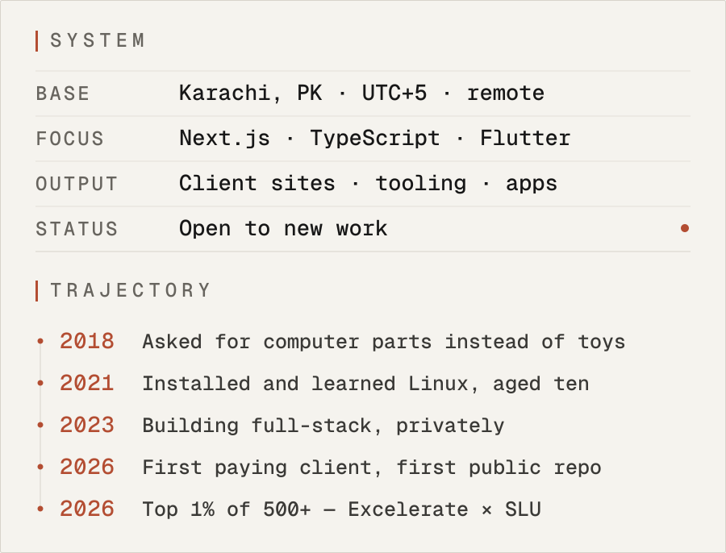
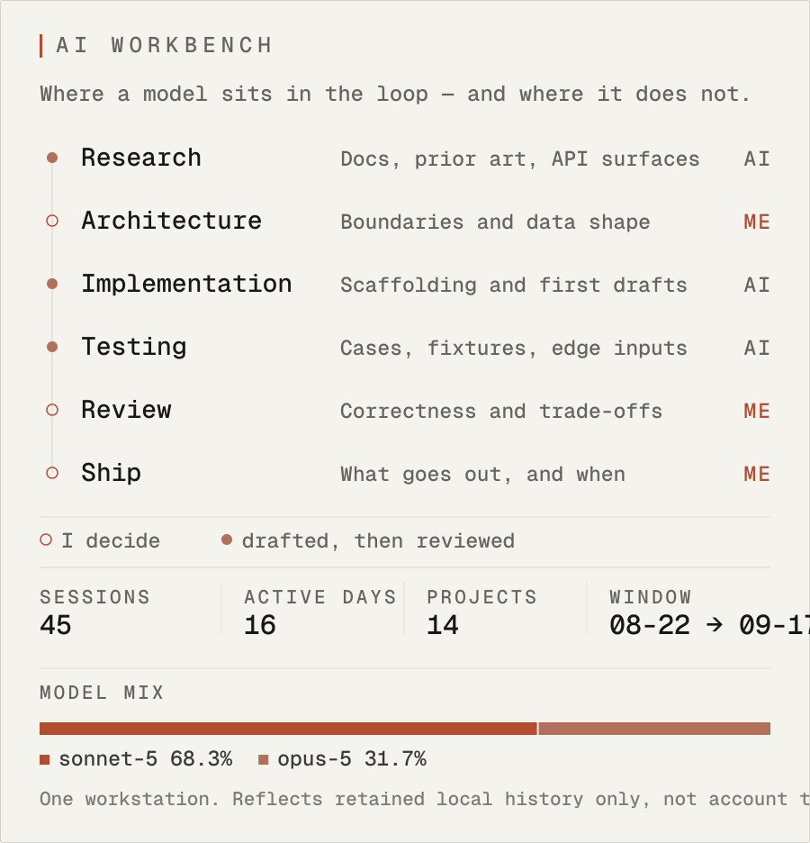
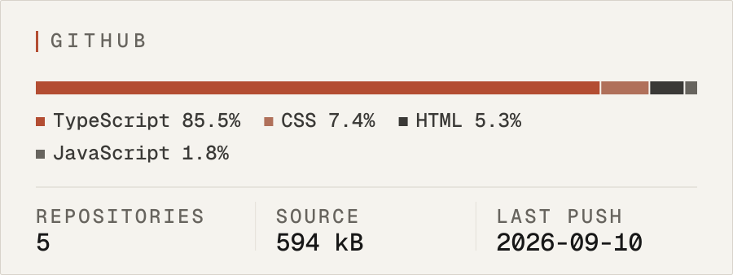

<picture>
  <source media="(prefers-color-scheme: dark)" srcset="assets/hero-dark.svg">
  
</picture>

I build production web and mobile software end to end — client sites that have to convert, internal tools that have to be right, and pipelines that run without me.

[**Live Dashboard ↗**](https://ammarahmeddevv.github.io/ammarahmeddevv/)  ·  [GitHub](https://github.com/ammarahmeddevv)  ·  [Portfolio](https://portfolio-ammarahmednot-8455s-projects.vercel.app)  ·  [work.ammarahmed@gmail.com](mailto:work.ammarahmed@gmail.com)

---

<picture>
  <source media="(prefers-color-scheme: dark)" srcset="assets/snapshot-dark.svg">
  
</picture>

**Star Performer — Mobile App Engineering Intern** · Excelerate × Saint Louis University · May – Jul 2026  
Top 1% of a 500+ engineer global cohort · \$1,000 scholarship awarded · 100% programme score

## Selected work

### F.F Real Estate

Client work · 2026 · Live · iterating

A Karachi property firm had no way to be found in a search result and no way to be contacted from one. Every page now routes to the same two actions — WhatsApp or call — behind a filterable listing the client publishes themselves.

- Embedded Sanity Studio at /studio — the client adds properties and photos with no code and no second login
- Filter by purpose, type, location, bedrooms, price and size, with a page per property
- JSON-LD, Open Graph and per-page metadata for the business and every listing

Next.js 15 · TypeScript · Sanity CMS · Tailwind CSS · Vercel  
[Live ↗](https://ff-real-estate-website.vercel.app)  ·  [Source ↗](https://github.com/ammarahmeddevv/ff-real-estate-website)

### LeadFlow

Data pipeline · 2026 · Private · running daily

Finds small businesses whose web presence is broken or missing, proves the breakage is real, ranks them by need, and produces a call list where every row carries a specific true observation.

- Deduplication tries five signals strongest-first — provider ID, phone, registrable domain, name within 120 m, then name and city. Merging only fills blanks.
- Every claimed website is fetched and graded into one of nine outcomes, from none_claimed through parked and thin to ok
- Runs itself every morning on GitHub Actions and syncs to Google Sheets without touching human-edited columns

| Market | Found | Cost | Qualified |
| --- | ---: | ---: | ---: |
| Austin, US | 320 | \$1.91 | 111 |
| Toronto, CA | 514 | \$3.08 | 410 |
| Munich, DE | 413 | free | 63 |
| Karachi, PK | 69 | free | 1 |

Real runs, not examples. Karachi returns a single qualified lead because there a missing website usually means not-yet-mapped rather than no website — so absence is never treated as a fact unless something corroborates it.

TypeScript · SQLite · Zod · Apify · Google Sheets API · GitHub Actions · Vitest  
Private — it runs my own outreach. Happy to walk the architecture and source on a call.

### Sales Hub

Internal tool · 2026 · Live

Pipeline, activity log and lead list in one view, reading and writing a Google Sheet as its database — so the data stays somewhere the owner can still open, sort and fix by hand.

- Google Sheets as the system of record, with the app as a typed interface over it
- Pipeline stages, activity history and lead detail without a second place to keep in sync

Next.js · TypeScript · Google Sheets API · Tailwind CSS  
[Live ↗](https://sales-hub-ammarahmednot-8455s-projects.vercel.app)  ·  [Source ↗](https://github.com/ammarahmeddevv/sales-hub)

### Event Hub

Team project · Excelerate × SLU · 2026 · Delivered

A cross-platform event management app built with two other engineers during the mobile internship — the work behind the Star Performer result.

- 12+ production screens across home, catalog, profile and event creation
- Debounced real-time search, Firebase auth and live sync, push via Firebase Cloud Messaging
- Built, signed and distributed as an Android APK outside the Play Store

Flutter · Dart · Firebase · REST  
[Source ↗](https://github.com/siddhantpatil681-afk/Team9-Excelerate-MADJune26-EventManagementApp)

### Also public

**Nexora** — A concept landing page for a fictional developer platform — built to push scroll-driven motion and WebGL further than a client brief usually allows.  
Next.js · React Three Fiber · GSAP · TypeScript  ·  [Live ↗](https://nexora-ammarahmednot-8455s-projects.vercel.app)  ·  [Source ↗](https://github.com/ammarahmeddevv/nexora)

**Fit Pro Gym** — A one-page site for a Karachi gym with no web presence. Hand-written HTML, CSS and JavaScript — no framework, no bundler, nothing to go stale.  
HTML · CSS · JavaScript · GitHub Pages  ·  [Live ↗](https://ammarahmeddevv.github.io/fitpro-gym-website/)  ·  [Source ↗](https://github.com/ammarahmeddevv/fitpro-gym-website)

## Stack

| | |
|---|---|
| **Languages** | TypeScript · JavaScript · Dart · Python · SQL |
| **Frontend** | React · Next.js · Tailwind CSS · Framer Motion · GSAP · Three.js / R3F |
| **Backend** | Node.js · Express · REST · WebSockets · Zod |
| **Mobile** | Flutter · Firebase · Android build & signing |
| **Data** | PostgreSQL · MongoDB · SQLite · Prisma · Redis · Sanity CMS |
| **Infra** | Vercel · GitHub Actions · Docker · Linux · AWS |
| **AI** | Anthropic API · OpenAI API · Claude Code |

## AI workbench

<picture>
  <source media="(prefers-color-scheme: dark)" srcset="assets/workbench-dark.svg">
  
</picture>

Counted from local Claude Code session transcripts, last measured 2026-09-17. One workstation. Reflects retained local history only, not account totals. No token counts or spend — a subscription has no honest per-session cost, so nothing here is denominated in either.

## GitHub

<picture>
  <source media="(prefers-color-scheme: dark)" srcset="assets/github-dark.svg">
  
</picture>

Measured in bytes across public repositories on 2026-09-17, not self-reported. Regenerated by `npm run sync:github`.

## Currently

**Now**  
LeadFlow — hardening the verification stage and the daily Actions run  
F.F Real Estate — post-launch iteration with the client in Sanity

**Next**  
A custom domain and a proper case-study write-up for each shipped project

**Exploring**  
Go, for the parts of the pipeline that should not be TypeScript  
Keeping engineering notes in Obsidian instead of in my head

## How I work

**A negative result gets verified before it gets trusted.**  
LeadFlow — A saturated DNS resolver looks exactly like a dead domain. That bug once put seven working businesses at the top of a call list, so every negative finding is now re-checked in isolation.

**Long jobs are resumable or they are not finished.**  
LeadFlow — Discovery covers a market in tiles, centre-outwards, so a run can be stopped, resumed, or split and retried without losing the work already done.

**Hand the client the keys, not a support contract.**  
F.F Real Estate — An embedded Sanity Studio means they publish properties and photos themselves — no code, no second login, no waiting on me.

**Every dependency is a future maintenance bill.**  
Fit Pro Gym — A one-page site for a local gym got hand-written HTML, CSS and JavaScript. No bundler, nothing to go stale, nothing to migrate in two years.

**AI drafts. I decide what ships.**  
LeadFlow — The resolver bug that poisoned a call list was not caught by a model. Scaffolding, tests and review passes come back fast; accountability for whether the thing is correct does not come back at all.

## Toolchain

| | |
|---|---|
| **Editor** | VS Code |
| **Shell** | Git Bash on Windows · Linux on servers |
| **Design** | Figma |
| **Debugging** | Chrome DevTools · Vitest |
| **AI** | Claude Code |
| **Notes** | Obsidian |

---

**Ammar Ahmed** · Karachi, Pakistan · PKT / UTC+5  
[Live Dashboard](https://ammarahmeddevv.github.io/ammarahmeddevv/)  ·  [GitHub](https://github.com/ammarahmeddevv)  ·  [Portfolio](https://portfolio-ammarahmednot-8455s-projects.vercel.app)  ·  [work.ammarahmed@gmail.com](mailto:work.ammarahmed@gmail.com)

Built from `data/*.json` — every figure on this page traces to a repository, a run log, or a programme record.
